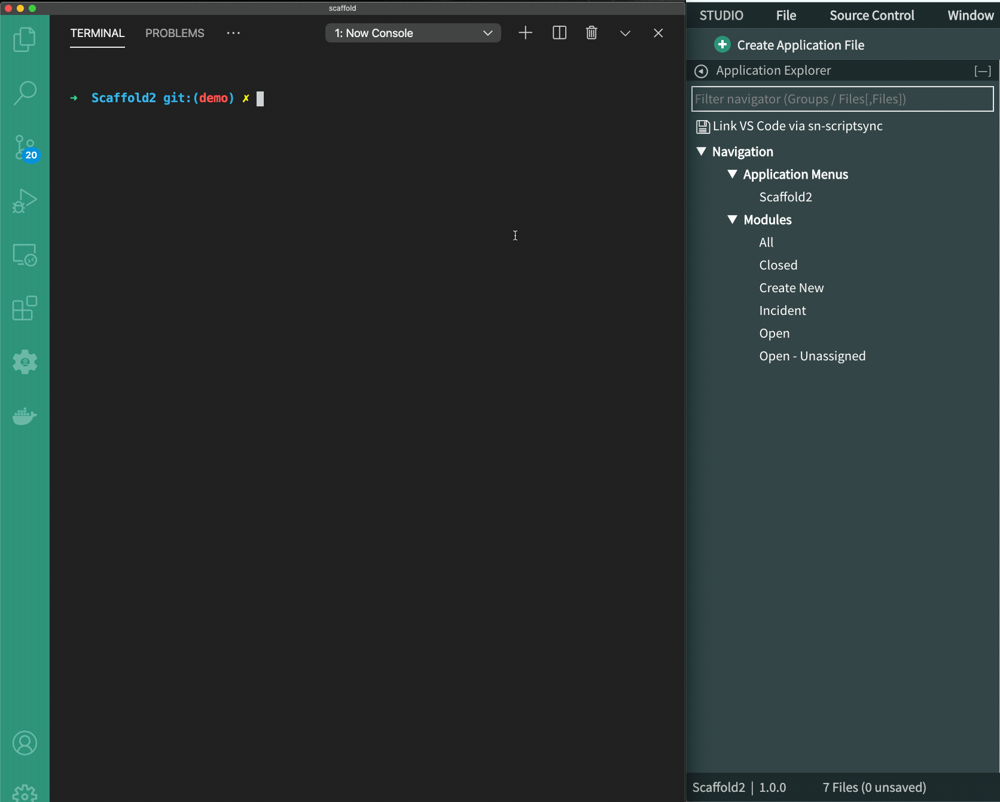

# Service Portal Scaffolding
Quickly scaffold service portal with pre-defined widget and style templates using VS Code ServiceNow extension.

## Setup
***
### 1. Prerequisite
This instruction makes certain assumptions about your local setup
- [node](https://nodejs.org/en/download/) installed (>11.10.1)
- [npm](https://www.npmjs.com/get-npm) installed (>6.7.0)
- [VS Code](https://code.visualstudio.com/docs/setup/setup-overview) installed
- [ServiceNow Extension for VS Code](https://docs.servicenow.com/bundle/newyork-application-development/page/build/applications/concept/vs-code.html) installed
***
### 2. Service Portal Scaffold Installation
Follow these steps to install Service Portal Scaffold locally
- `git clone https://github.com/asc2683/sn-scaffold.git`
- `cd` into `sn-scaffold`
- `npm install`
- `npm link` 

*Note: __npm install__ installs all dependencies required by service portal scaffold and __npm link__ makes the CLI available globally*

***
### 3. Verify Installation
Verify installation is successful by typing
- `portal --help`

If the installation is successful, you will see USAGE instructions. If not, please try installation again
***

### 4. Create Scoped Application
Service Portal Scaffold should be used to scaffold a new service portal and should not be used with existing service portal

- Follow these steps to create a [scoped application](https://docs.servicenow.com/bundle/paris-application-development/page/build/guided-app-creator/concept/guided-app-creator.html)
- After successfully creating a scoped app, open VS Code and connect to your instance using [ServiceNow Extension for VS Code](https://marketplace.visualstudio.com/items?itemName=ServiceNow.now-vscode)
- Designate a workspace and select Custom Applications -> Import existing -> Select the application you created above -> Keep all selection --> Press OK

### 5. Scaffold a Service Portal using Templates
- Find your workspace for the above application and `cd` into the application
- Type `ls` and you should see a `src` folder. Service Portal Scaffold will scaffold the template files into this `src` folder
- To scaffold service portal using a template, use the following command
`portal create --template demo` 
- In the above command, we're scaffolding service portal using the demo template. The files for the demo template can be found here: `sn-scaffold/templates/demo`
- To scaffold service portal using a default template, use the following command
`portal create`
*** 
### 6. Sync with Instance
- After the scaffolding has run successfully, sync your workspace with the instance using VS Code ServiceNow Extension
- Sync by clicking the `Sync Current Project icon` on the status bar in VS Code
- You can also press `CMD+OPT+S` on MacOS or `CTRL+ALT+S`​​ on Windows to sync the project
- More information on how to synchronize current project between [VS Code and a ServiceNow instance](https://docs.servicenow.com/bundle/paris-application-development/page/build/applications/task/synchronize-files.html)

***
### Contribution
Contribution for templates, feedbacks, features, enhancements, testing, and bug fixes are welcomed. Contribution guidelines... (WIP)
***
### Note
This is a personal open-source project and is neither endorsed nor supported by any organizations or institutions
